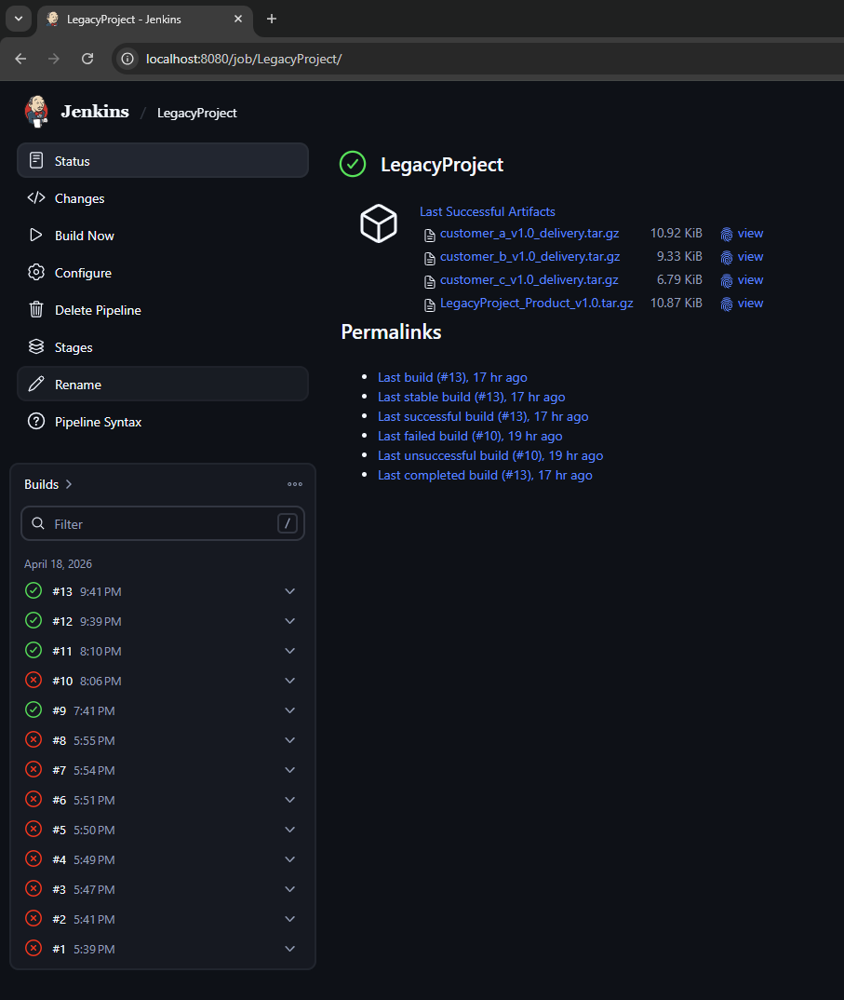

# LegacyProject

## Part 0 — Created dummy libraries that just print some text

First step was to build the libraries completely manually and test them.
After doing it manually I've created the CMakeLists.txt for each of them and pushed to the repository.

This is the commit for it: https://github.com/Illibur/LegacyProject/commit/8d7f27b90d85bc3c430e86c3099b50b0290dc94d

Once it was done I moved to the part 1.

## Part 1 — Dependency Management with Conan

I've provided some artifacts that show for libmarket/1.0.0 the shared library libcore/1.0.0 is taken from the Conan cache.

This is the commit for it: https://github.com/Illibur/LegacyProject/commit/043d62322c4c91beaa06f93dee2c4eb532bb2ee5

For the first (shared) library libcore the conan had to build it:
```python
======== Computing dependency graph ========
Graph root
    cli
Requirements
    libcore/1.0.0#a485b52086419056cc8f4bc0fa6dca79 - Cache

======== Computing necessary packages ========
libcore/1.0.0: Forced build from source
Requirements
    libcore/1.0.0#a485b52086419056cc8f4bc0fa6dca79:38b8b2863892fd9462affa45e40edf183b436246 - Build
```

For the libmarket that depends on libcore only the libmarked had to be built, the libcore is provided by conan cache:
```python
======== Computing dependency graph ========
Graph root
    cli
Requirements
    libcore/1.0.0#a485b52086419056cc8f4bc0fa6dca79 - Cache
    libmarket/1.0.0#e68fdb83961636fb437ae7588744bd5b - Cache

======== Computing necessary packages ========
libmarket/1.0.0: Forced build from source
Requirements
    libcore/1.0.0#a485b52086419056cc8f4bc0fa6dca79:38b8b2863892fd9462affa45e40edf183b436246#b4bff65c4c0e6ef035e00d1303d28ad9 - Cache
    libmarket/1.0.0#e68fdb83961636fb437ae7588744bd5b:3bba3f553868fea9f13bc993604ca96f3aba84e5 - Build
```

For the static library:
```python
======== Computing dependency graph ========
Graph root
    cli
Requirements
    libutils/1.0.0#b653bb5ecb047eea0482b0022c5abda8 - Cache

======== Computing necessary packages ========
libutils/1.0.0: Forced build from source
Requirements
    libutils/1.0.0#b653bb5ecb047eea0482b0022c5abda8:38b8b2863892fd9462affa45e40edf183b436246 - Build
```

For the engine:
```python
======== Computing dependency graph ========
Graph root
    conanfile.py: /data/LegacyProject/engine/conanfile.py
Requirements
    libcore/1.0.0#a485b52086419056cc8f4bc0fa6dca79 - Cache
    libmarket/1.0.0#e68fdb83961636fb437ae7588744bd5b - Cache
    libutils/1.0.0#b653bb5ecb047eea0482b0022c5abda8 - Cache

======== Computing necessary packages ========
Requirements
    libcore/1.0.0#a485b52086419056cc8f4bc0fa6dca79:38b8b2863892fd9462affa45e40edf183b436246#b4bff65c4c0e6ef035e00d1303d28ad9 - Cache
    libmarket/1.0.0#e68fdb83961636fb437ae7588744bd5b:3bba3f553868fea9f13bc993604ca96f3aba84e5#6df9cc1a53e525b2faee6b9da0bc2a83 - Cache
    libutils/1.0.0#b653bb5ecb047eea0482b0022c5abda8:38b8b2863892fd9462affa45e40edf183b436246#8c6c8f678c43c1247e5db7e8e2e18f23 - Cache

======== Installing packages ========
libcore/1.0.0: Already installed! (1 of 3)
libutils/1.0.0: Already installed! (2 of 3)
libmarket/1.0.0: Already installed! (3 of 3)
```

For the gateway:
```python
======== Computing dependency graph ========
Graph root
    conanfile.py: /data/LegacyProject/gateway/conanfile.py
Requirements
    libcore/1.0.0#a485b52086419056cc8f4bc0fa6dca79 - Cache
    libutils/1.0.0#b653bb5ecb047eea0482b0022c5abda8 - Cache

======== Computing necessary packages ========
Requirements
    libcore/1.0.0#a485b52086419056cc8f4bc0fa6dca79:38b8b2863892fd9462affa45e40edf183b436246#b4bff65c4c0e6ef035e00d1303d28ad9 - Cache
    libutils/1.0.0#b653bb5ecb047eea0482b0022c5abda8:38b8b2863892fd9462affa45e40edf183b436246#8c6c8f678c43c1247e5db7e8e2e18f23 - Cache

======== Installing packages ========
libcore/1.0.0: Already installed! (1 of 2)
libutils/1.0.0: Already installed! (2 of 2)
```
---

## Part 2 — CI Pipeline

I've started a docker container with Jenkins server on the VM where the tests were done.
```bash
docker run -d \
  -p 8080:8080 -p 50000:50000 \
  -v /data/jenkins_home:/var/jenkins_home \
  -v /data/jenkins_tmp:/tmp \
  -v /var/run/docker.sock:/var/run/docker.sock \
  -v /data/LegacyProject:/data/LegacyProject \
  --name jenkins-server \
  -e JAVA_OPTS="-Dhudson.node_monitors.DiskSpaceMonitorDescriptor.threshold=100MB -Dhudson.node_monitors.TemporarySpaceMonitorDescriptor.threshold=100MB -Dhudson.plugins.git.GitSCM.ALLOW_LOCAL_CHECKOUT=true" \
  jenkins/jenkins:lts

# docker logs jenkins-server - to get the admin password
```

This is the commit for it: https://github.com/Illibur/LegacyProject/commit/2d288b743bc9e9cf17911ba91294321ef5f38066

And it looked like this in the GUI:



## Part 3 — Customer Variant Management

Separate config files were added for each customer depending on which the engine app can be customized.
Also, Jenkinsfile was configured to pack different subset of components and the configuration file.

As a result of the pipeline we'll have the artifacts the full project with all apps and libraries and the archive with everything is needed for each customer.

This is the commit for it: https://github.com/Illibur/LegacyProject/commit/d2c03b8264d5808438fea2ea1d61a8c22fadf7dc

## Part 4 — Summarize and Review

`Architecture decisions: why you chose this structure, what alternatives you considered`

1. The pipeline produces a single product bundle with all components and libraries. Customer specific subset of components is created from the specific apps and libraries that is needed for each of them respectively.
The alternative would be to have separate builds for each customer. In this case we'd need to build the same applications/libraries multiple times which is not efficient and will only get worse for more clients.

2. Works:

    - With the current config covers the failure point of the binary mismatch.

    - The base image ensures that we'll have the same packages (compiler, CMake, conan) and we'll have the same output for builds on different machines.

    - For new customers support we just need to modify the Jenkinsfile config.

    Doesn't work:

    - Currently, the conan cache is local to Jenkins workspace. Once we recreate it the binaries must be rebuilt from scratch. In real world scenario we'll need a conan registry to cover all developers.

    - Currently, the versions for the libraries are hardcoded in conanfile.py, and to update one we need to do it in multiple places.

    - For a massive monolith with thousands of files, running conan create for every library in every build would become a bottleneck. We would need to implement Binary Promotion, where the CI only builds the specific component that changed and pulls everything else from a remote cache.

3. Biggest challenges. Some of them were not related to the task itself, but to the fact that I was not familiar with Jenkins. And I didn't allocate enough disk space for the /var partition on the test VM (where the base image is located and takes some space). Jenkins is not working if there is less than 1GB free disk space left and that was fixed by modifying the defaults to 100MB (and other modifications).

    Another problem that I've encountered was when I've tried to modify the version of one of the libraries, but once I executed the applications I saw that the old one is still being used. And it was caused by the logic of copying all *.so libs from conan cache, not the specific/needed ones. That made the old lib with the same name override the new one as it was copied at last. To fix this I've used conan direct_deploy to a new folder and took the libs from it. I suppose this can be solved in a better way.

4. Add a test/verification stage to Jenkinsfile to start the application with a test config to make sure it runs, not only builds.

    Start a remote conan registry, so if the specific version of the library exists then in the CI job it's pulled/fetched not built.

    If there is sensitive information in the customer specific config files then we should move it from the files stored on git.

    Add logic for conan to read the tags from git, so if a new version is released no manual changes are needed.

    Add static analysis to be able to see the relevant data using the jenkins warning plugin (I don't know how it looks like, but sounds promising).

5. I didn't cover:
    - security scans for conan dependencies and docker base image for vulnerabilities;
    - the mentioned database scripts. They can be added to Jenkinsfile to be packed in the final archive if needed;
    - any testing stages for the libraries.

## Results

Product bundle:

```bash
personal@machine:.../LegacyProject_Product_v1.0/product_bundle$ ls
engine  gateway  liblibcore.so  liblibmarket.so  run_engine.sh  run_gateway.sh
personal@machine:.../LegacyProject_Product_v1.0/product_bundle$ ./run_engine.sh
[Engine] Starting high-performance engine...
--- Loading Config: config.ini ---
Warning: config.ini not found. Using defaults.

[libcore] Initializing Core Monolith Components. Version 1.0.1
[libmarket] Accessing market data...
[libcore] Initializing Core Monolith Components. Version 1.0.1
[libutils] Utility helper (Static Link)
personal@machine:.../LegacyProject_Product_v1.0/product_bundle$ ./run_gateway.sh
[Gateway] Starting API Gateway...
[libcore] Initializing Core Monolith Components. Version 1.0.1
[libutils] Utility helper (Static Link)
```
CustomerA:

```bash
personal@machine:.../customer_a_v1.0_delivery$ ls
config.ini  engine  gateway  liblibcore.so  liblibmarket.so  run_engine.sh  run_gateway.sh
personal@machine:.../customer_a_v1.0_delivery$ ./run_engine.sh
[Engine] Starting high-performance engine...
--- Loading Config: config.ini ---
Config Param: mode=premium
Config Param: threads=8

[libcore] Initializing Core Monolith Components. Version 1.0.1
[libmarket] Accessing market data...
[libcore] Initializing Core Monolith Components. Version 1.0.1
[libutils] Utility helper (Static Link)
personal@machine:.../customer_a_v1.0_delivery$ ./run_gateway.sh
[Gateway] Starting API Gateway...
[libcore] Initializing Core Monolith Components. Version 1.0.1
[libutils] Utility helper (Static Link)
```

CustomerB:

```bash
personal@machine:.../customer_b_v1.0_delivery$ ls
config.ini  engine  liblibcore.so  liblibmarket.so  run_engine.sh
personal@machine:.../customer_b_v1.0_delivery$ ./run_engine.sh
[Engine] Starting high-performance engine...
--- Loading Config: config.ini ---
Config Param: mode=basic
Config Param: threads=4

[libcore] Initializing Core Monolith Components. Version 1.0.1
[libmarket] Accessing market data...
[libcore] Initializing Core Monolith Components. Version 1.0.1
[libutils] Utility helper (Static Link)
```

CustomerC:

```bash
personal@machine:.../customer_c_v1.0_delivery$ ls
config.ini  gateway  liblibcore.so  liblibmarket.so  run_gateway.sh
personal@machine:.../customer_c_v1.0_delivery$ ./run_gateway.sh
[Gateway] Starting API Gateway...
[libcore] Initializing Core Monolith Components. Version 1.0.1
[libutils] Utility helper (Static Link)
```

